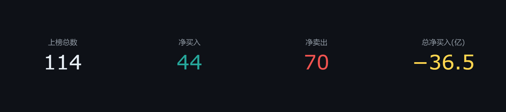
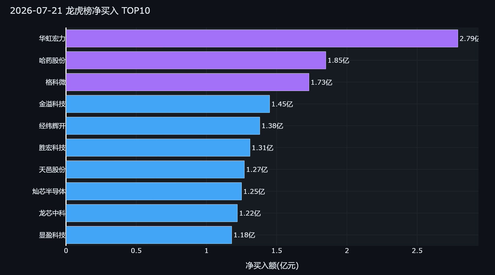
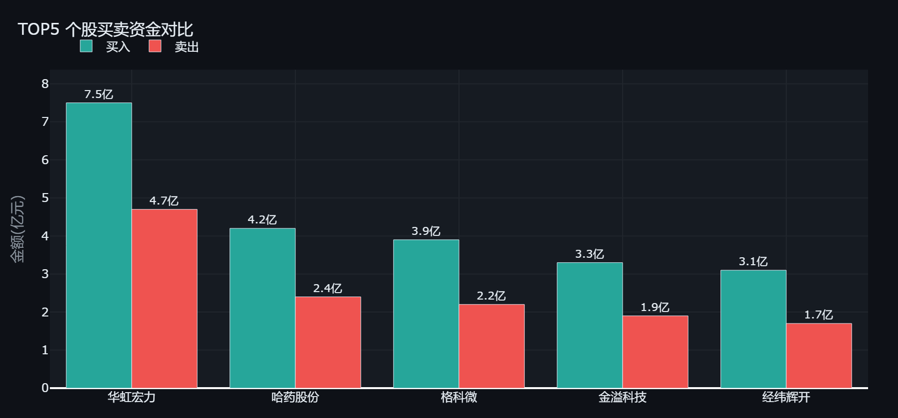
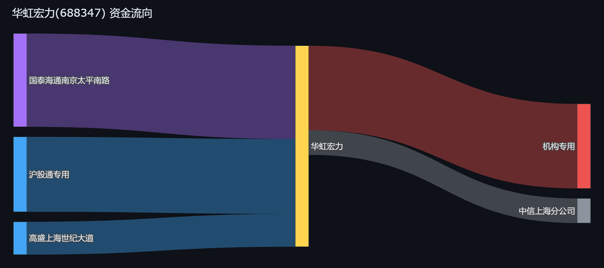

<div align="center">

# 🐉 Dragon Tiger AI

### A股龙虎榜 AI 智能解读工具

**自动抓取龙虎榜数据 → AI深度解读游资动向 → 生成可视化投资简报**

[](https://www.python.org/downloads/)
[](LICENSE)
[](https://github.com/akfamily/akshare)

[功能特性](#-功能特性) · [快速开始](#-快速开始) · [效果预览](#-效果预览) · [AI解读示例](#-ai解读示例) · [架构设计](#-架构设计)

</div>

---

## ✨ 功能特性

<table>
<tr>
<td width="50%">

### 📊 全自动数据抓取
- 基于 **akshare** 免费获取东方财富龙虎榜公开数据
- 当日总览 / 个股席位明细 / 营业部统计，一行代码搞定
- 本地 CSV 缓存，避免重复请求

</td>
<td width="50%">

### 🤖 AI 智能解读
- 接入 **DeepSeek / GPT-4o / 通义千问** 等主流 LLM
- 个股资金性质判断、多空博弈分析
- 板块联动分析、营业部席位画像
- 3 套 Jinja2 Prompt 模板，可自由定制

</td>
</tr>
<tr>
<td width="50%">

### 🎨 可视化 Dashboard
- 深色金融主题 **Streamlit** Web 界面
- **Plotly** 交互式图表：柱状图、散点图、桑基图、树形图
- KPI 指标卡、数据表格、一键下载报告

</td>
<td width="50%">

### 📋 一键报告生成
- Markdown + TXT 双格式输出
- 每日自动运行，支持 `cron` 定时任务
- 可直接发到雪球、公众号、GitHub

</td>
</tr>
</table>

---

## 🚀 快速开始

```bash
# 1. 克隆项目
git clone https://github.com/Bruce-HuYihang/dragon-tiger-ai.git
cd dragon-tiger-ai

# 2. 安装依赖
pip install -e ".[dev]"

# 3. 配置 API Key（支持 DeepSeek / OpenAI / 通义千问等）
cp .env.example .env
# 编辑 .env，填入你的 LLM_API_KEY

# 4. 生成今日龙虎榜AI简报
python daily_run.py

# 5. 启动多Agent协作分析流水线
python run_multi_agent.py                    # 分析昨天数据
python run_multi_agent.py 2026-07-21         # 分析指定日期

# 6. 启动盘中异动监控（交易时段自动检测新上榜股票）
python run_multi_agent.py --monitor          # 监控4小时
python run_multi_agent.py --monitor --duration 60  # 监控1小时

# 7. 启动可视化 Dashboard
streamlit run src/dragon_tiger/app/main.py
```

> 💡 **不需要LLM也能用！** `python daily_run.py --no-ai` 可以生成纯数据概览报告（跳过AI分析）

---

## 📊 效果预览

### 市场概览 KPI



### 净买入 TOP10



### 买卖资金对比



### 个股资金流向（桑基图）



### Streamlit Dashboard


---

## 🧠 AI 解读示例

> 以下为 2026-07-21 龙虎榜真实数据，由 **DeepSeek** 自动生成分析

### 华虹宏力 (688347) — 净买入 2.79亿

**上榜原因**: 日收盘价格涨幅达到20%

**【买入席位TOP5】**
- 国泰海通南京太平南路: 买入 53500万元 (4.15%)
- 沪股通专用: 买入 43000万元 (3.34%)
- 国泰海通总部: 买入 23200万元 (1.80%)
- 高盛上海世纪大道: 买入 18800万元 (1.46%)
- 中信证券上海分公司: 买入 12500万元 (0.97%)

**AI 解读摘要:**

> 顶级游资**国泰海通南京太平南路**以5.35亿高居买一，占总成交4.15%，具有明显的**主导地位**。结合其历史上偏好半导体龙头标的的操作风格，本次买入具有**板块风向标**意义。
>
> **沪股通**呈现多空对决：买入4.3亿、卖出5.28亿，净卖出约1亿——说明**外资对高位存在分歧**。高盛上海世纪大道买入1.88亿，属于**量化/外资机构**的配置型买入。
>
> 卖方出现两家**机构专用席位**合计减持3.25亿，这是需要注意的**获利了结信号**。总体判断为**游资+量化主导、机构逢高减仓**的混合博弈格局。

---

## 🏗️ 架构设计

```
┌─────────────────────────────────────────────────────────────┐
│                     DATA SOURCE (akshare)                    │
│           东方财富龙虎榜 · 席位明细 · 营业部统计               │
└──────────────────────────┬──────────────────────────────────┘
                           ▼
┌─────────────────────────────────────────────────────────────┐
│                   DataFetcher 数据获取层                      │
│  get_daily_lhb()  ·  get_stock_lhb_detail()  ·  get_yyb()   │
└──────────┬───────────────────────────────────────┬───────────┘
           ▼                                       ▼
┌─────────────────────┐                 ┌─────────────────────┐
│   CSV / JSON 缓存    │                 │   AIAnalyzer         │
│   本地持久化          │                 │   DeepSeek / GPT     │
└─────────────────────┘                 │   Jinja2 Prompts     │
                                          └─────────┬───────────┘
                                                    ▼
                    ┌───────────────┬───────────────┬──────────────┐
                    ▼               ▼               ▼              ▼
            ┌─────────────┐ ┌─────────────┐ ┌─────────────┐ ┌──────────┐
            │  Markdown    │ │  Plotly     │ │  Streamlit  │ │  定时任务  │
            │  每日报告     │ │  交互图表    │ │  Dashboard  │ │  APScheduler│
            └─────────────┘ └─────────────┘ └─────────────┘ └──────────┘
```

---

## 📁 项目结构

```
dragon-tiger-ai/
├── src/dragon_tiger/
│   ├── data/
│   │   └── fetcher.py          # 数据获取层（6个akshare接口封装）
│   ├── analysis/
│   │   ├── analyzer.py         # AI分析引擎（LLM调用+Prompt渲染）
│   │   ├── backtest.py         # 历史回测验证（上榜后收益、营业部胜率、净买入相关性）
│   │   ├── sentiment.py        # 新闻舆情分析（新闻获取+LLM情绪判断+交叉验证）
│   │   └── prompts/            # 3套Jinja2 Prompt模板
│   │       ├── stock_analysis.j2   # 个股龙虎榜解读
│   │       ├── sector_analysis.j2  # 板块联动分析
│   │       └── yyb_profile.j2      # 席位画像
│   ├── visualization/
│   │   └── charts.py           # 7种Plotly图表（深色金融主题）
│   ├── app/
│   │   └── main.py             # Streamlit Dashboard（6个页面，含历史回测）
│   ├── reports/
│   │   └── generator.py        # 每日报告生成器（支持回测+舆情）
│   └── mcp_server.py           # MCP Server（FastMCP，供Claude/Cursor调用）
├── tests/                      # 单元测试
├── daily_run.py                # 每日自动运行脚本（支持 --with-backtest --with-sentiment）
├── run_mcp_server.py           # MCP Server 启动脚本
├── .env.example                # 环境变量模板
└── pyproject.toml              # 项目配置
```

---

## ⚙️ 配置说明

支持任意 **OpenAI 兼容接口**，按需修改 `.env`：

```bash
# DeepSeek（推荐，性价比高）
LLM_API_KEY=sk-xxx
LLM_BASE_URL=https://api.deepseek.com/v1
LLM_MODEL=deepseek-chat

# 或 OpenAI
LLM_API_KEY=sk-xxx
LLM_BASE_URL=https://api.openai.com/v1
LLM_MODEL=gpt-4o-mini

# 或 通义千问
LLM_API_KEY=sk-xxx
LLM_BASE_URL=https://dashscope.aliyuncs.com/compatible-mode/v1
LLM_MODEL=qwen-turbo
```

---

## 🗺️ 路线图

- [x] 当日龙虎榜数据抓取（akshare）
- [x] 个股买卖席位明细（买入TOP5 + 卖出TOP5）
- [x] 营业部历史上榜统计
- [x] AI 个股解读（资金性质 + 多空博弈）
- [x] AI 板块联动分析
- [x] AI 营业部席位画像
- [x] Plotly 交互式图表（7种）
- [x] Streamlit 深色主题 Dashboard
- [x] Markdown/HTML 报告生成
- [x] 每日定时自动运行
- [x] 盘中实时异动监控（新上榜股票检测 + 快速席位分析）
- [x] 关联新闻舆情分析
- [x] 历史回测验证（席位上榜后N日收益统计）
- [x] 多Agent协作架构（DataCollector → SeatAnalyzer → MarketAnalyzer → ReportWriter）
- [x] MCP Server 封装

---

## ⚠️ 免责声明

本工具生成的所有分析内容仅供**技术研究和学习交流**使用，**不构成任何投资建议**。股市有风险，投资需谨慎。请投资者独立判断，自行承担投资风险。

---

## 🤝 贡献

欢迎提交 Issue 和 PR！

- 发现 Bug → [提交 Issue](https://github.com/Bruce-HuYihang/dragon-tiger-ai/issues)
- 补充营业部数据 → Fork 后 PR
- 优化 Prompt 模板 → 在 `src/dragon_tiger/analysis/prompts/` 下改进

---

<div align="center">

**Dragon Tiger AI** · 用 AI 读懂游资的语言

Made with 🐉 by [Bruce-HuYihang](https://github.com/Bruce-HuYihang)

</div>