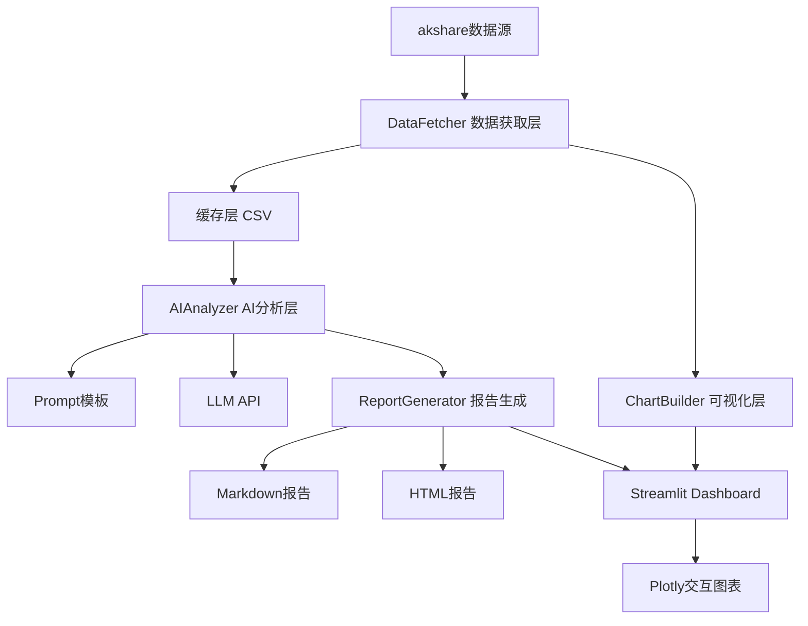

# 🐉 Dragon Tiger AI - A股龙虎榜AI智能解读工具

> 每日自动抓取龙虎榜数据，AI深度解读游资动向，生成可视化投资简报。

[](https://www.python.org/downloads/)
[](LICENSE)
[]()

---

## ✨ 核心卖点

- **全自动数据抓取** — 基于 akshare，一行代码取遍龙虎榜数据
- **AI智能解读** — 不是简单的数据搬运，而是"游资分析师"视角的深度解读
- **席位画像系统** — 追踪知名游资营业部的历史操作风格
- **板块联动分析** — 发现资金在产业链上的布局逻辑
- **可视化Dashboard** — 交互式图表，深色主题，金融级视觉体验

---

## 📊 Demo 预览

> 截图占位区 — 待替换为实际运行截图

```
┌──────────────────────────────────────────────────┐
│  🐉 Dragon Tiger AI - 2026-07-22 龙虎榜简报      │
│                                                  │
│  今日上榜: 47只 | 净买入: 23只 | 净卖出: 24只    │
│  ┌──────────────────────────────────────────┐    │
│  │  🔥 净买入TOP5                            │    │
│  │  1. 贵州茅台(600519) +8.5亿              │    │
│  │  2. 宁德时代(300750) +6.2亿              │    │
│  │  ...                                      │    │
│  └──────────────────────────────────────────┘    │
└──────────────────────────────────────────────────┘
```

---

## 🚀 快速开始

### 1. 克隆项目
```bash
git clone https://github.com/yourname/dragon-tiger-ai.git
cd dragon-tiger-ai
```

### 2. 安装依赖
```bash
pip install -e ".[dev]"
```

### 3. 配置环境
```bash
cp .env.example .env
# 编辑 .env 填入你的 LLM_API_KEY
```

### 4. 运行
```bash
# 启动 Streamlit Dashboard
streamlit run src/dragon_tiger/app/main.py

# 或直接生成今日报告
python daily_run.py --date 2026-07-22
```

---

## 📁 项目结构

```
dragon-tiger-ai/
├── src/dragon_tiger/
│   ├── data/           # 数据获取层（akshare封装）
│   ├── analysis/       # AI分析层（LLM Prompt + 解读）
│   │   └── prompts/    # Prompt模板
│   ├── visualization/  # 可视化层（Plotly图表）
│   ├── app/            # Streamlit前端
│   └── reports/        # 报告生成
├── tests/              # 单元测试
├── data_cache/         # 数据缓存
├── reports/            # 报告输出
├── daily_run.py        # 每日自动运行脚本
└── pyproject.toml      # 项目配置
```

---

## 🏗️ 架构图



---

## 🔧 功能特性

- [x] 当日龙虎榜数据抓取
- [x] 个股龙虎榜明细查询
- [x] 营业部历史统计
- [ ] AI个股解读
- [ ] 板块联动分析
- [ ] 席位画像
- [ ] Streamlit Dashboard
- [ ] 每日自动报告
- [ ] 历史回测验证

---

## 📋 示例报告

查看 `examples/` 目录下的每日AI分析报告示例。

---

## ⚠️ 免责声明

本工具生成的所有分析内容仅供技术研究和学习交流使用，**不构成任何投资建议**。股市有风险，投资需谨慎。请投资者独立判断，自行承担投资风险。

---

## 🤝 贡献指南

欢迎提交 Issue 和 PR！详见 [CONTRIBUTING.md](CONTRIBUTING.md)

---

## 📄 许可证

MIT License - 详见 [LICENSE](LICENSE)